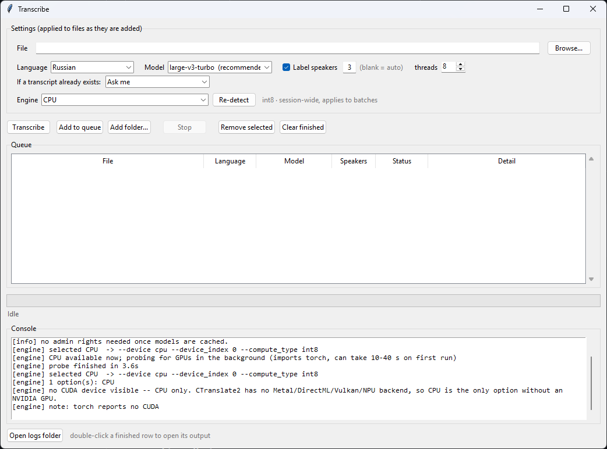

# Transcribe

A small Windows desktop app that turns meeting recordings into speaker-labelled
transcripts, entirely on your own machine. No cloud service, no upload, no
per-minute billing.

Built on [faster-whisper](https://github.com/SYSTRAN/faster-whisper) via
[whisper-ctranslate2](https://github.com/Softcatala/whisper-ctranslate2), with
speaker diarization from [pyannote.audio](https://github.com/pyannote/pyannote-audio).
The GUI is plain `tkinter` — no Qt, no GTK, no Electron, no extra runtime.

[](LICENSE)


---

## Why this exists

Whisper is excellent and free, but getting speaker-labelled Russian output on a
CPU-only Windows laptop involves a chain of undocumented failures: a PyTorch 2.6
unpickling change that breaks pyannote checkpoints, a Windows symlink privilege
that silently kills model downloads, a batching flag that quietly destroys
speaker attribution. This app encodes the fixes so you never meet them.

## Features

- **Speaker labels** — `[SPEAKER_00]`, `[SPEAKER_01]`, … with a fixed count or
  automatic detection
- **Batch queue** — add files with per-file settings, start a bulk run, add more
  while it is running
- **Skip or reprocess** existing transcripts, with a policy you choose
- **Real progress bar with ETA**, derived from segment timestamps rather than a
  spinner that tells you nothing
- **Five output formats** per file: `.txt`, `.srt`, `.vtt`, `.tsv`, `.json`
- **Engine selector** — CPU or CUDA, listing only what your machine actually has,
  detected once and cached
- **Runs offline** after first-time model download; audio never leaves the machine
- **No admin rights** for everyday use
- Automatic audio normalisation (16 kHz mono, cover-art stripped)
- Per-run and per-session logs on disk

## Screenshot

<!-- Add a screenshot as docs/screenshot.png and it will render here -->


---

## Requirements

| | |
|---|---|
| OS | Windows 10 / 11 |
| Python | 3.9 or newer (Setup installs 3.12 if missing) |
| Disk | ~2 GB for models |
| RAM | 8 GB minimum, 16 GB comfortable |
| GPU | Not required — CPU only by design |
| ffmpeg | Recommended, installed automatically |
| HuggingFace account | Free; needed **only** for speaker labels |

## Installation

Clone or download the repository, then from an **elevated** PowerShell:

```powershell
cd path\to\whisper-transcribe-gui
Set-ExecutionPolicy -Scope Process -ExecutionPolicy Bypass
.\Setup.ps1
```

`Setup.ps1` installs Python and ffmpeg via winget if missing, installs
**CPU-only** PyTorch plus the Python packages, prompts for a HuggingFace token
in a dialog (with a *How do I get one?* guide and a live *Test token* button),
enables Developer Mode, and pre-downloads the models.

Elevation is needed **once**, for two reasons only: enabling Developer Mode, and
downloading models before that privilege is active in your logon token. After a
sign-out and sign-in, nothing ever needs admin again.

Useful flags:

```powershell
.\Setup.ps1 -TokenOnly     # just re-run the token dialog
.\Setup.ps1 -SkipModels    # install software, skip the ~1.6 GB download
.\Setup.ps1 -Force         # re-ask for a token even if one is stored
```

### Manual installation

```powershell
pip install torch --index-url https://download.pytorch.org/whl/cpu
pip install -r requirements.txt
winget install Gyan.FFmpeg.Shared
setx HF_TOKEN "hf_your_token_here"
```

Then enable Developer Mode (Settings → System → For developers) and sign out and
back in. See [docs/TROUBLESHOOTING.md](docs/TROUBLESHOOTING.md) for why.

---

## Usage

Double-click **`Transcribe.bat`**.

### One file

1. **Browse…** and choose a recording
2. Pick the language, model and speaker count
3. Press **Transcribe**

### A batch

1. **Browse…**, set the options for that file, press **Add to queue**
2. Repeat — each file keeps the settings that were active when it was added
3. Or **Add folder…** to queue every recording in a directory
4. Press **Transcribe queue (N)**

Files can be added while a batch is running; the worker picks them up. Jobs run
strictly one at a time, because Whisper already uses every core — running two at
once finishes the batch later, not sooner.

### Output

For `meeting.mp3` you get a folder `meeting_transcript\` containing:

```
meeting.txt    speaker-labelled plain text
meeting.srt    subtitles with timings
meeting.vtt    WebVTT
meeting.tsv    tab-separated start/end/text
meeting.json   full segment data
```

```
[SPEAKER_01]: Приветствую, это Настя.
[SPEAKER_00]: Рад знакомству, Настя.
[SPEAKER_00]: Я Слава.
```

Speaker labels are anonymous. Nothing can know who `SPEAKER_00` is — read the
first exchanges and rename them yourself.

---

## Choosing a model

Measured on 8 physical cores, `int8`, for a 59-minute Russian call:

| Model | Time | Notes |
|---|---|---|
| `large-v3-turbo` | **~70 min** | Recommended. 4 decoder layers instead of 32. |
| `large-v3` | ~3-4 h | Marginally better on non-English; rarely worth the wait on CPU. |
| `medium` | ~45 min | Noticeably weaker on names and technical terms. |
| `small` | ~20 min | Usable for gist only. |
| `tiny` | ~5 min | Testing the pipeline, nothing else. |

Times scale roughly linearly with audio length and inversely with core count.

## Speaker count

Give the exact number when you know it. Automatic detection (leave the box
blank) works, but pyannote infers the count by clustering and tends to
**over-split**: one participant on a poor connection, or switching between
headset and speakerphone, often becomes two speakers, and a mostly-silent
participant can disappear. The app reports how many it found after each run so
you can sanity-check the result.

Expect diarization error around 11–19% on clean audio and worse with crosstalk.
Overlapping speech is where it fails hardest, and multi-party calls have plenty.

## Engine selection

The **Engine** dropdown lists only the devices present on your machine. It is
detected on first launch and cached, so later startups are instant; press
**Re-detect** after installing a GPU or changing PyTorch.

The compute type is chosen for you — `int8` on CPU, `float16` on CUDA — from
whatever CTranslate2 reports as supported for that device.

Engine is a **session-wide** setting, not per file: an entire batch runs on one
device. The dropdown is disabled while a batch is running.

If you only see one CPU entry, that is correct and not a detection failure.
CTranslate2, the runtime beneath faster-whisper, implements **CPU and CUDA
backends only** — there is no Metal, DirectML, Vulkan or NPU path, and an
AMD Ryzen AI NPU cannot be used at all. AMD ROCm builds of CTranslate2 present
themselves as `cuda`.

`--threads` affects CPU inference only and is ignored on CUDA.

## Privacy

- Audio is processed locally. It is never uploaded anywhere.
- The only network traffic is a one-time model download from huggingface.co.
- The HuggingFace token authenticates that download and nothing else.
- After the first run the app works fully offline.

## How it works

```
recording ──ffmpeg──> 16 kHz mono WAV ──┐
                                        ├─> Silero VAD ─> whisper-ctranslate2
HF cache ──> pyannote diarization ──────┘                 (CTranslate2, int8)
                                                                  │
                                        speaker turns ────────────┤
                                                                  ▼
                                                    txt / srt / vtt / tsv / json
```

The app writes a small shim that patches `torch.load` before importing
whisper-ctranslate2. See [docs/ARCHITECTURE.md](docs/ARCHITECTURE.md) for the
reasoning and the other workarounds.

## Known limitations

- Windows only. The core is cross-platform but Setup, the launcher and the
  privilege handling are Windows-specific.
- CPU only. No CUDA or ROCm path; `--device cuda` is untested here.
- **Do not enable batched inference when you need speaker labels.** It merges
  output into ~30-second blocks and collapses attribution — on a 3-speaker test
  it reported 2 and produced repetition loops. The app leaves it off.
- Diarization has no idea who anyone is; labels are anonymous by construction.
- Long recordings write output only when the whole file is finished. A cancelled
  run produces nothing.

## Troubleshooting

Every failure encountered while building this, with causes and fixes:
**[docs/TROUBLESHOOTING.md](docs/TROUBLESHOOTING.md)**

Quick hits:

| Symptom | Cause |
|---|---|
| `WinError 1314` | Symlink privilege — enable Developer Mode, then **sign out and in** |
| `UnpicklingError ... weights_only` | PyTorch ≥ 2.6 vs pyannote; the shim handles it |
| `running scripts is disabled` | `Set-ExecutionPolicy -Scope Process -ExecutionPolicy Bypass` |
| HTTP 403 from HuggingFace | Accept the gated model conditions with the token's own account |
| Speaker labels missing | `HF_TOKEN` not set in the current session |

## Contributing

See [CONTRIBUTING.md](CONTRIBUTING.md). Bug reports with a log file from
`logs\` are the most useful thing you can send.

## Licence

[MIT](LICENSE) © 2026 Yaroslav Dubenskiy

## Acknowledgements

- [OpenAI Whisper](https://github.com/openai/whisper)
- [faster-whisper](https://github.com/SYSTRAN/faster-whisper) and [CTranslate2](https://github.com/OpenNMT/CTranslate2)
- [whisper-ctranslate2](https://github.com/Softcatala/whisper-ctranslate2)
- [pyannote.audio](https://github.com/pyannote/pyannote-audio)
- [Silero VAD](https://github.com/snakers4/silero-vad)
- [large-v3-turbo CTranslate2 conversion](https://huggingface.co/mobiuslabsgmbh/faster-whisper-large-v3-turbo)
